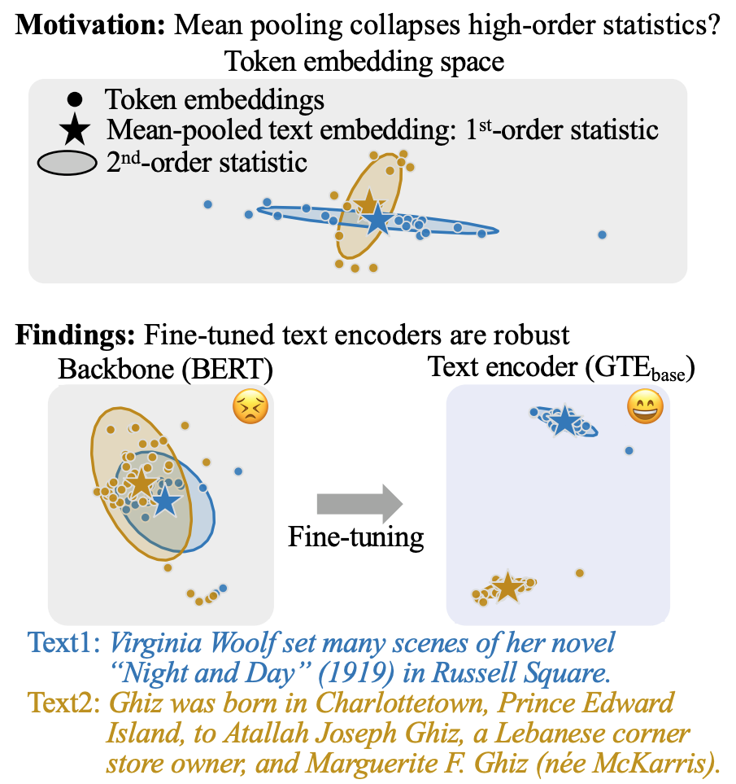

# Why Mean Pooling Works: Quantifying Second-Order Collapse in Text Embeddings

[-blue)](https://2026.aclweb.org/)
[](https://arxiv.org/abs/2604.27398)
[](https://opensource.org/licenses/MIT)

This repository contains code for the paper [Why Mean Pooling Works: Quantifying Second-Order Collapse in Text Embeddings](https://aclanthology.org/2026.acl-long.2183/).
This work investigates why modern text encoders work well despite using seemingly coarse mean pooling.

<p align="center">
  
</p>

## Requirements

- Python >= 3.12.8
- [uv](https://github.com/astral-sh/uv)
- CUDA-capable GPU recommended for running the full experiments

## Setup

Install dependencies using [uv](https://github.com/astral-sh/uv):

```bash
uv sync
```

All scripts should be run from the project root (`./`).

## Creating Datasets

Run the following scripts to download and preprocess each dataset before running experiments. Datasets are saved to `data/`.

Wikipedia

```bash
bash scripts/data/make_wiki_dataset.sh
```

MS MARCO

```bash
bash scripts/data/make_msmarco_dataset.sh
```

Hard Negatives

```bash
bash scripts/data/make_hard_negatives_dataset.sh
```

## Running Experiments and Visualizing Results

### SOCM

Calculate pairwise SOCM on Wikipedia and MS MARCO, and on hard negatives.

```bash
bash scripts/calc_socm.sh
```

Results are saved to `results/socm/`. See the following notebooks for visualization:

- `notebooks/quantitative_analysis.ipynb`
- `notebooks/qualitative_analysis.ipynb`

### Token Concentration

Calculate layer-wise $S(\boldsymbol{X})/\|\boldsymbol{\mu}(\boldsymbol{X})\|_2^2$ for mean pooling and last-token pooling.

```bash
bash scripts/calc_token_concentration.sh
bash scripts/calc_last_token_concentration.sh
```

Results are saved to `results/token_concentration/` and `results/last_token_concentration/`. See `notebooks/token_concentration.ipynb` for visualization.

### $\lambda$

Calculate layer-wise $\lambda$.

```bash
bash scripts/calc_lambda.sh
```

Results are saved to `results/lambda/`. See `notebooks/lambda.ipynb` for visualization.

### $r$

Calculate layer-wise $r$.

```bash
bash scripts/calc_r.sh
```

Results are saved to `results/r/`. See `notebooks/r.ipynb` for visualization.

### $C$

Calculate layer-wise $C$.

```bash
bash scripts/calc_C.sh
```

Results are saved to `results/C/`. See `notebooks/C.ipynb` for visualization.

### MTEB Evaluation

Evaluate models on the MTEB English benchmark (v2).

```bash
bash scripts/run_mteb.sh
```

Results are saved to `results/mteb/`. See `notebooks/corr_task_performance.ipynb` for visualization.

### Average Cosine Similarity

Calculate layer-wise average cosine similarity between token representations within each text.

```bash
bash scripts/calc_avg_cos.sh
```

Results are saved to `results/avg_cos/`. See `notebooks/avg_cos.ipynb` for visualization.

### Scatter Plot of $d_\mu$ and $d_\Sigma$

Scatter plot of $d_\mu$ and $d_\Sigma$. See `notebooks/scatter_dmu_dsigma.ipynb`.

## Repository Structure

```text
.
├── src/          # Source code
├── scripts/      # Shell scripts to run experiments
├── notebooks/    # Jupyter notebooks for visualization
├── data/         # Datasets (CSV)
├── results/      # Experiment results (CSV)
└── tests/        # Tests
```

## Citation

```bibtex
@inproceedings{hara-etal-2026-mean,
    title = "Why Mean Pooling Works: Quantifying Second-Order Collapse in Text Embeddings",
    author = "Hara, Tomomasa  and
      Kurita, Hiroto  and
      Imaizumi, Masaaki  and
      Inui, Kentaro  and
      Yokoi, Sho",
    editor = "Liakata, Maria  and
      Moreira, Viviane P.  and
      Zhang, Jiajun  and
      Jurgens, David",
    booktitle = "Proceedings of the 64th Annual Meeting of the {A}ssociation for {C}omputational {L}inguistics (Volume 1: Long Papers)",
    month = jul,
    year = "2026",
    address = "San Diego, California, United States",
    publisher = "Association for Computational Linguistics",
    url = "https://aclanthology.org/2026.acl-long.2183/",
    pages = "47180--47201",
}
```
